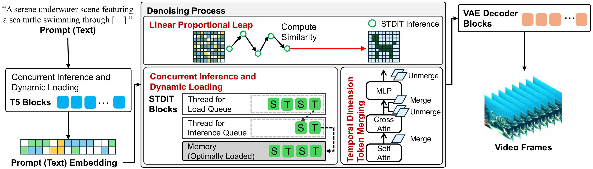

# [WACV 2026] Mobile-Oriented Video Diffusion: Enabling Text-to-Video Generation on Mobile Devices Without Retraining, Compression, or Pruning

This repository provides code for **Mobile-Oriented Video Diffusion: Enabling Text-to-Video Generation on Mobile Devices Without Retraining, Compression, or Pruning**.
It is based on the implementation of [Open-Sora](https://github.com/hpcaitech/Open-Sora).


Accepted to to WACV 2026!

## Introduction

Mobile-Optimized Video Diffusion (MOVD) is the first model training-free solution for diffusion-based on-device text-to-video generation that operates efficiently on smartphone-grade devices.

MOVD proposes two novel techniques:
- *Linear Proportional Leap (LPL)* reduces the excessive denoising steps required in video diffusion through an efficient leap-based approach
- *Temporal Dimension Token Merging (TDTM)* minimizes intensive token-processing computation in attention layers by merging consecutive tokens along the temporal dimension

MOVD proposes an implementation technique to address the limited memory challenge:
- *Concurrent Inference with Dynamic Loading (CI-DL)* enables large models to be split into smaller segments for execution in limited memory environment.




## How to convert each model to MLPackage

### Package Dependencies

```
cd Device_conversion

conda create -n convert python=3.10

conda activate convert

pip install -r requirements/requirements-convert.txt

pip install -v .
```

### Converting

#### T5 Converting
```
cd t5
python3 export-t5.py
```

#### STDiT Convering
```
cd stdit3
python3 export-stdit3.py
```

#### VAE Converting
When you run `export-vae-spatial.py`, There are some error that is `Fatal Python error: PyEval_SaveThread`.
To address this error, you should only run one code block for each VAE part. Comment out the rest.

```
cd vae

# for vae's temporal part
python3 export-vae-temporal.py

# for vae's spatial part
python3 export-vae-spatial.py
```

## How to Use

### Required
* Mac device for xcode
* Apple Account to build and launch the app
* iPhonne: over iPhone 15 pro
* iOS version: over 18
* All MLPackage (T5, STDiT, VAE)

### Download converted MLPackage (if you don't want to convert each model to MLPackage)

You can download and use the converted models from the following link. [[Download](https://drive.google.com/drive/folders/1L6pVi3KmyLygR_pvKofRL-21adKsEb4p?usp=sharing)]

### Run the app
* Implement xcode project by clicking On-Device-MOVD-Sora/On-Device-MOVD-Sora.xcodeproj
* Change the Team (None -> Your Apple account) in TARGETS/Signing&Capabilities
* Launch the app
### Example artifacts

